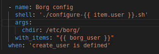
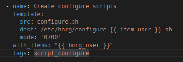
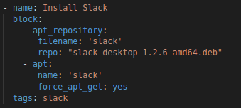

# Ansible
De forma não técnica, assim como uma orquestra necessita de um maestro para guiá-la, as máquinas monitoradas precisam de uma máquina “Mestre” (Ansible-server) e uma das formas de se fazer isso, é através do Ansible.

## **O'que é ansible?**
É uma ferramenta de **orquestração** de dispositivos/servidores que usa a linguagem **YAML**.


> O'que "ser uma ferramenta de orquestração" quer dizer?

Quer dizer que o ansible-server consegue:

- Gerenciar as configurações;
- Coordenar os clientes;
- Implanta aplicações;
- Automatizar tarefas;

## **Por que utilizar o ansible?**
Pois é uma forma fácil de automatizar tarefas. Imagine se ao invéz de rodar um **playbook** do ansible e configurar o Nginx (Que é um servidor web) para 200 sites diferentes, tivéssemos que fazê-lo um por um?!

## **Como funciona o Ansible?**
### "rodar um playbook"?? Mas, o'que é um playbook??
O Ansible é dividido basicamente entre:

- Playbook;
- Hosts;
- Role;
- Tasks;
- Módulos.

Irei explicá-los:

## **Playbook**

- **Documento** *escrito no formato* **YAML**;
- Contém tudo que será executado:
  -  Em quais hosts que as 'mudanças' serão aplicadas;
  -  As variáveis que serão usadas.


## **Hosts**

- **Documento** *escrito no formato* **YAML**;
- Contém os hosts que podem sofrer alterações.

Somente os hosts aqui citados podem ser referenciados no Playbook (normalmente em forma de grupos)

## **Role**

- **Diretório**;
- Contém as tarefas que serão executadas.


## **Tasks**

- **Listas** no formato **YAML**;
- Contém os **módulos** que serão executados


## **Módulos**

- '**Comandos**' que ditam as tarefas que serão executadas pela **task**.

[Link para os Módulos do Ansible](https://docs.ansible.com/ansible/latest/modules/list_of_all_modules.html) 

# **Abordagens mais práticas** 
`Playbook (Arquivo.YML)` **--Contém-->** `Roles (Diretório)` **--Contém-->** `Tasks (Diretório)` **--Contém-->** `Main.yml (Arquivo.YML)` **--Contém-->** `Módulos (comandos)`

Além das **tasks**, existem outros diretórios que são usados **handlers**, **files**, **meta**, **defaults** e **templates**. Cada um tem sua função específica.

- **Handlers**
  - É um diretório contendo uma arquivo main.yml *escrito no formato* **YAML**  que serve para realizar tarefas um pouco diferentes das que os módulos fazem. É válido ressaltar que ela só executa as tarefas, quando chamadas pela task através do comando **Notify**.

- **Files**
  - É um diretório contendo uma arquivo main.yml *escrito no formato* **YAML** onde incluímos arquivos que serão necessários na role
    
- **Defaults**
  - É um diretório contendo uma arquivo main.yml *escrito no formato* **YAML** que é responsável por declarar **variáveis padrão** para a role.

- **Templates**
  - É um diretório com **modelos de arquivos** que serão usados nas roles. Por exemplo alguma configuração personalizada.

- **Meta**
  - É um diretório contendo uma arquivo main.yml *escrito no formato* **YAML**  que apresenta algumas dependências.

Por último, gostaria de falar sobre uma 'seção' do playbook. A seção "**vars**". Simula o **default**. Porém, enquanto a role **default** declara variáveis para roles específicas, na seção **vars**, podemos declarar variáveis que podem ser usadas em qualquer role.

## **Comandos**
- Rodando um playbook
```
ansible-playbook -i <hosts> <projeto.yml>
```

- Rodando um playbook em um host usando outra porta:
```
ansible-playbook -i <hosts> <projeto.yml> -e ansible_ssh_port=11022
```


## **Artifícios Do Ansible**

- Podemos condicionar as tasks usando '**when**';\


obs.: 'create_user' é uma variável da minha role.

- Podemos dividir as tasks por '**tags**';\


obs.: Possibilita a execução específica de uma parte da role e auxilia na organização.

- Podemos usar listas, dicionários e variáveis (default, playbook).\


- Podemos usar '**Blocos**' de tasks.\



Mais exemplos podem ser encontrados no meu repositório do [gitlab](https://gitlab.com/GabrielFontes/estagio/tree/master/roles)
