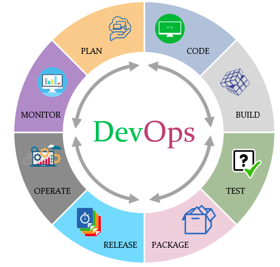

# How to become a DevOps Engineer

DevOps is the union between developers and operators. The mean is in the first place, velocity in the software production, and the second place, harmony between software and servers in production. Does not exist junior DevOps engineers. To become DevOps is difficult and necessariely depends on the previous knowledge. Other mean is the iteration and Continuos Feedback to the time. The benefices of the Devops are: Short development cycle, increase release velocity, Reduced errors because the tests are automatic.

The basic steps are: plan, code, build, test, package, release, operate, monitor.

I will follow the proposal for  Kamranahmedse. Kamaranahmedse is a developer and his github is very useful.The idea about the RoadMap is to show my way and this is important. I will begin in the next month. 
Using RoadMap makes it possible to change tasks

I used the references: 
https://medium.com/hackernoon/the-2018-devops-roadmap-31588d8670cb
https://medium.com/@devfire/how-to-become-a-devops-engineer-in-six-months-or-less-366097df7737
https://github.com/raycad/devops-roadmap?source=post_page-----dde388eb65bd----------------------
https://medium.com/@raycad.seedotech/devops-methodology-and-process-dde388eb65bd
https://github.com/kamranahmedse/developer-roadmap
