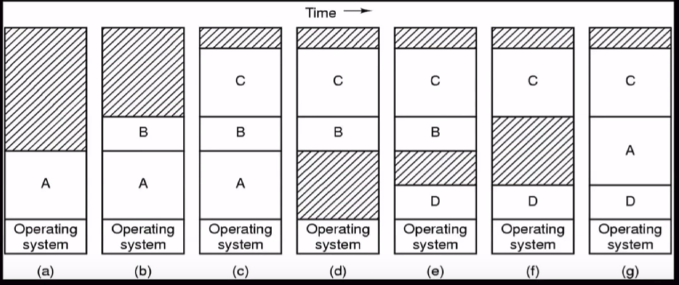

# Sistema Operacional

Já imaginou se tivéssemos que nos preocupar integralmente com:
- A quantidade de recursos que cada programa iria usar?
- Qual momento cada programa irá usar qual recurso?

Seria uma bagunça não é mesmo? Quem faz tudo isso pra gente, é o **sistema operacional**. Ele é um "software" de sistema responsável por fornecer uma interface entre o usuário e o computador e gerenciar recursos. 

Segundo Tanenbaum um sistema operacional tem 2 funcionalidades:
- **Olhando de cima pra baixo (Como Usuário):**
  - Abstração do hadware fazendo o meio de campo entre o usuário e o hadware;
- **Olhando de baixo pra cima (Como Hadware):**
  - Gerenciar os recursos que as aplicações usarão e a ordem das suas execuções. 


O sistema operacional:

- **Gerencia recursos** (Hadware e Sofware);
    - Dispositivos de entrada e saída;
    - Gerencia processos e o processador;
    - Gerencia de memória.
- **Gerencia arquivos**;
- **Controla a entrada e saída de dados**.


# Gerenciar recursos
## Gerenciamento de processos e do processador
### **O que é processo?**
    
Processo é a unidade básica de execução de qualquer sistema operacional. É uma ou mais **Threads** de um programa que serão executadas pelo processador.

Mas, oque são **threads**?
## **Thread**

Uma **Thread** é um fluxo de controle dentro de um processo (Denota o "Caminho que deve ser feito"). Um processo multithreaded é um processo que contém vários fluxos de controle diferentes.


 > Um exemplo de processo multithread é o google chrome. Já repoarou como conseguímos ouvir uma música em uma aba enquanto lemos um artigo em outra aba de forma simultânea? Isso só acontece porque esse navegador é Multithread.

### **Tipos de threads**:

- **Thread de Usuário**:

São as threads geradas pelas aplicações.

- **Thread de Kernel**:

São threads de usuário **"traduzidas"** para threads que podem ser executadas pelo processador.

### **Tradução das threads**

Uma aplicação não consegue conversar diretamente com o processador, diferentemente do **kernel** (esse assunto será abordado em outro tópico do repositório). Dessa forma, a **'tradução'** que pode ser de 4 formas:

- Transformação - Híbrida


- Transformação - Muitos para um


- Transformação - Muitos para Muitos
  


- Transformação - Um para Um


## **Execução dos processos**

A execução desses processos pode ser feita de três formas dependendo do sistema:
- **Sistemas Bach - Sistemas Monotarefa** : Executa um processo por vez de forma interrupta;

- **Sistemas de Tempo Compartilhado - Sistemas Multitarefas** : Fatias de tempo no processador para cada processo (Uma vez que meu foco maior é o **Linux**, focarei minhas explicações no sistema Multitarefa).

- **Sistemas de Tempo real** : É baseada em prioridades. Não existe fatia de tempo para as tarefas em execução. Um processo fica em execução até que apareça algum com maior prioridade que ele.

Irei abordar o Sistema Multitarefa.

### **Sistemas Multitarefas**

**Como ocorre a gerência dos processos?**

Existe uma fila de processo que são classificados de acordo com os seus estados:

- **Novo**: O processo está sendo criado;
  
- **Executando**: Instruções estão sendo executadas;

- **Bloqueado**: Aguardando alguma resposta de uma operação de entrada e saída 

    **Exemplo**:

    Quando tentamos fechar um programa, e aparece uma mensagem de erro avisando que o programa não está respondendo. As vezes, esse erro pode ser porque antes de fechar aquele programa, as dependências tem que ser encerradas. Então o programa só encerra quando as dependências são encerradas;

- **Pronto**: Aguardando o processamento;

- **Encerrado**: Já foi executado.

### **Chaveamento de processos**


Como o processo não fica em execução até terminar (Como acontece nos Sistemas em Tempo Real), existe um **Escalonamento** entre o processo que está em execução e um processo que já está pronto.


A esse processo, damos o nome de Over Head.


O **OverHead** é um chaveamento. É o momento em que um processo é salvo e o outro é carregado. Além do OverHead, existe um outro conceito que diz respeito a chaveamento de processos. Quando o chaveamento não ocorre de forma correta, ocorre o **DeadBlock** que é o bloqueio de dois processos que disputam um mesmo recurso

### **Comunicação entre processos (IPC)**

Existem aplicações que dividem seus processos para otimizar o tempo no processador. Essa divisão pode ocorrer de duas formas:
- **Por troca de mensagens**: Existem duas classificações
    - **Síncronas (Bloqueantes)**;
      - O emissor da mensagem, fica bloqueado até que ele receba uma mensagem de confirmação do receptor;
      - O receptor fica bloqueado até a recepção da mensagem.

    - **Assíncronas (Não bloqueantes)**.
       - O emissor, salva a mensagem no buffer de envio e continua executando suas tarefas;

  - **Por memória compartilhada**.
      - Os processos trocam informações lendo e gravando dados na região compartilhada.


Quando falamos da memória compartilhada, existe um problema:
### **Condição de corrida**
É um problema que pode ocorrer sempre que dois ou mais processos compartilham um mesmo recurso. Por exemplo.

```
Processo 1 - Steve 

Processo 2 - Márcio

Processo 3 - Fontes

    Steve: Quantos reais você tem na conta, Fontes? 
    Fontes: 10,00 R$

Aqui finalizamos a comunicação Steve-Fontes!

    Márcio: Quantos reais você tem na conta, Fontes?
    Fontes: 10,00 R$

Aqui finalizamos a comunicação Márcio-Fontes!

    Steve: Diminuia 2 reais dos 10 R$ que você tem!
    Fontes: Ok (Agora estou com 10 - 2 = 8,00 R$)

Aqui finalizamos a comunicação Steve-Fontes!

    Márcio: Aumente 6 reais dos 10 R$ que você tem! (Ele não sabe que eu tenho 8)
    Fontes: Ok ( Agora estou com 8 + 6 = 14,00 R$, Márcio acha que tenho 16,00 R$)

Aqui finalizamos a comunicação Márcio-Fontes!
```

Note que houve inconsistência nos resultados finais. Para evitar isso, 
existe uma **região crítica** e a **exclusão múltipla**.

- **Região crítica**: Define-se uma área do algoritmo que não pode ser acessada concorrentemente por mais de uma linha de execução.

- **Exclusão múltipla**: Um processo só acessa a área do algoritmo quando o outro terminar


O receptor sabe onde fica as mensagens e através de testes periódicos (**polling**) ele checa se existe mensagem e enquanto não tiver, continua executando as tarefas.

# Gerenciamendo de memória

O sistema Operacional é responsável por:
- Gerenciar os espaços livres/ocupados;
- Alocar e localizar processos/dados na memória.
- Mapeamento da memória;
- Alocar e desalocar processos.
- Cuidar do swapping (TIrar o conteúdo da memória principal e colocar no disco)

Memória é uma parte do hadware do computador que armazena dados e programas acessados. Se os dados não estiverem na memória, para que a CPU possa operar sobre eles, eles devem ser transferidos para lá. Existem vários tipos de memória:

- **Registradores**
  -  Memória que se encontra dentro do processador. Acesso Muito Rápido

- **Memória cache**
  - Extremamente rápida. Porém, volátil e tem pouco espaço de armazenamento (Na ordem dos MegaBytes). Como a Memória RAM é muito lenta e o processador não pode esperar,

- **Memória principal (Memória RAM)**
  - Mais lenta que a Memória cache, volátil e armazenamento na ordem dos (Gigabytes). A chamada memória RAM é o local utilizado pelo processador para armazenar as informações de tudo o que estiver aberto em seu computador.

    **E quando a memória RAM se esgota, o que acontece?**

    O processo utiliza a memória virtual.

    - **Memória virtual**
      - É uma forma de estender a quantidade de memória para os dados temporários utilizados pelos aplicativos em execução sem que você precise fazer um upgrade de hardware.

- **Memória secundária**
  - Não pode ser endereçada diretamente e para acesso aos dados, é necessário o ser carregamento em memória principal antes de poder tratá-los no processador.

Esquema de hierarquia das memórias:


Fazendo uma relação entre os processos e a memória. Já que o processo deve estar na memória principal para ser executado, o que acontece no chaveamento?

**R**: Ele pode ser transferido temporariamente da memória principal para uma memória de retaguarda e, então, trazido de volta à memória principal para continuar a Execução. O nome disso é Swapping

# **Na multiprogramação** 
- A memória é dividida em partições;
- 2 Registradores ficam responsáveis por armazenar a base e o limite do programa.

        Exemplo:
        Um programa de 40 Kb e ele foi armazenado no endereço 20, deveremos alocar 20 (base) + 40 = 60 (Limite)

MMU faz a conversão é um módulo de hadware responsável por fazer a conversão do


    Endereço lógico (Como o programa vai trabalhar) ---para---> Endereço físico (Endereço de verdade)

## **Partição fixas**
As partições não variam. Eu fixo o valor do processo e aloco esse espaço específico. Isso gera desperdícios:

- **Fragmentação Interna**:\
  Quando o tamanho do processo é menor que a área alocada

- **Fragmentação Externa**:\
  Quando o espaço alocado não é contíguo.


# Partição variável
Alocação dinâmica, por tempo de execução:

- As partições são criadas de acordo com a execução dos processos.




Isso acaba com a Fragmentação interna. Mas, não com a Fragmentação externa. Se um processo é criado e ele ocupa menos espaço que a lacuna de memória ele é dividido em duas partes uma sendo a primeira ocupada pelo processo e a segunda com o espaço remanescente. 


# Estruturas para gerenciamento de memória

As estratégias usadas pelo Sistema operacional para endereçamento são:
  - **Bit map**;
  - **Lista Encadeada**.


- **BitMaps**:\
    São mapas de bits que indicam a sequência de bits que mostram as regiões que estão alocadas e as regiões não alocadas. O '1' indica espaço ocupado e o '0', espaço livre.

- **Lista encadeada**:\
    Guarda as sequências alocadas ou não alocadas.

    **No exemplo acima**:

        Do espaço 0 até o espaço 5, temos o processo A e por isso:

    > **P** (indica processo) | **0** (Indica ponto de início) | **5** (Indica o comprimento)

        Depois, temos um ponteiro que aponta para a próxima partição:
    > **H** (Indica o espaço livre) | **5** (Indica ponto de início) | **3** (Indica o comprimento) 

# Gerenciar arquivos

Os arquivos são a forma como o sistema operacional permite a gravação e leitura de dados. A gerência do sistema de arquivos cuida da estrutura, identificação, acesso, utilização, proteção e implementação dos arquivos.

O que são arquivos?
    
**R:** São um conjunto de bits relacionados que podem ser um conjunto de dados ou um conjunto de instrução (Executáveis)

Ponto de vista dos arquivos:
- **Ponto de vista do usuários (Alto nível)**
  - Interface, Nomeação e Proteção.

- **Ponto de vista do sistema operacional (Baixo nível)**
  - Referenciamento e armazenamento físico.

Os arquivos são criados por processos. O arquivo é reconhecido por:
- **Nome do arquivo**
- **Extensão** : Qual o tipo do arquivo (identificação do conteúdo)

 Sabendo que os arquivos são um conjunto de bits, posso apresentar que nos sistemas operacionais existem 3 formas de organizar os arquivos:

- **Não estruturada**
  - Não segue uma estrutura lógica para os bytes, existem $n$ bytes que se relacionam com um arquivo.

- **Registro de tamanho fixo**
  - Cada arquivo tem um espaço limitado para o registro.

- **Árvore de registro**
  - Os registros (Não necessariamente do mesmo tamanho) tem um ponteiro e um dado que se relacionam.

Existem alguns tipos de arquivos, falerei de dois:
- **Regulares** : Qualquer arquivo que armazena informações do usuário.
- **Diretórios** : Usado para organização do sistema de arquivos.

Um arquivo possui vários atributos (proteção, Senha, instante do último acesso, instante de criação, etc.) mostrarei alguns:


Consegue ver essas letras antes dos arquivos? (d,r,w,x,r,l)

Cada uma delas tem uma representatividade.

- O primeiro caracter representa o tipo de arquivo:
    - "-" : Arquivos regulares.
    - "d" : Diretório.
    - "l" : link.
        - Os três próximos caracteres representam as permissões do proprietário:
            - "r" (read) : A permissão de leitura refere-se à capacidade do usuário de ler o conteúdo do arquivo.
            - "w" (write) : As permissões Write referem-se à capacidade do usuário de gravar ou modificar um arquivo ou diretório.
            - "x" (execute) : A permissão Executar afeta a capacidade de um usuário de executar um arquivo ou visualizar o conteúdo de um diretório.
        - Os próximos três caracteres representam as permissões do grupo
        - Os próximos três caracteres representam as permissões do usuário
            - obs.: o "t" no arquivo 'tmp', designa permissões avançadas
- O número após as permissões, apresenta a quantidade de vezes que o arquivo é "chamado em outro lugar" (Hard Links).
- Após o número, temos  **"Propriétario:Usuário"**  do arquivo.

Uma observação bacana de se expor são os valores que as permissões podem ter. É possível designar permissões a algum arquivo através da soma dos valores das configurações:

- **r** = 4
- **w** = 2
- **x** = 1

O primeiro número da soma representa a permissão do proprietário, o segundo, representa as permissões do grupo e o último apresenta permissões para todos os outros usuários.

**Exemplo**:


## Estrutura de diretórios do Linux

-  /**bin**: Guarda **comandos** binários essenciais para o sistema;
-  /**boot**: Guarda arquivos de **inicialização**;
-  /**etc**: Guarda os arquivos de **configurações** do sistema;
-  /**lib**: Guarda as **bibliotecas** necessárias para os comandos presentes no /bin e /sbin;
-  /**mnt**: Guarda as **partições** de dispositivos instalados;
-  /**opt**: Guarda **pacotes** não oficiais da distro;
-  /**dev**: Arquivos de entrada e saída;
-  /**usr**: Hierarquia secundária disponibilizada para todos os usuários;
-  /**home**: Diretório dos usuários


# Gerenciamento dos Dispositivos de entrada e saída

Para Engenheiros, o hadware equivale a um conjunto de chips, ligações elétricas, etc. Para um programador, é uma interface de comunicação com o dispositivo.

Como já sabemos, o sistema operacional atua na abstração do hadware. Para isso, existem os **Drivers** que são programas responsáveis pela comunicação entre sistema operacional e hadware.


Dispositivos de hardware precisam ser controlados para proporcionar a entrada e saída de dados para o processador para fazer esse controle, existem:

- **Controlador de Hadware**
  - Interface física formado por um conjunto de componentes eletrônicos que podem operar uma **porta**, um **bus** ou um dispositivo.

- **Software Controlador**
  - Programa capaz de acessar um dispositivo E/S

## Hadware
Um dispositivo comunica-se com o sistema através de sinais enviados por cabos ou até mesmo através do ar. Existe um ponto de conexão que é denominado **"Porta"**. Existem algumas configurações:

- **Bus**
  - Quando os dispositivos compartilham um conjunto de fios e seguem um protocolo que especifica um conjunto de mensagens que podem ser enviadas nos fios.

- **Cadeia Margarida**
  - Quando o dispositivo 'A' tem um cabo que se conecta ao dispositivo 'B', o dispositivo 'B' tem um cabo que se conecta ao dispositivo 'C', e o dispositivo 'C' se conecta a uma porta no computador.

o Softwares de controle é feito pensando nas seguintes proposições:

Um programa deverá ser capaz de ler/escrever um arquivo da mesma forma para qualquer dispositivo.

A nomeação deve ser uniforme, logo costuma acessar os arquivos através do caminho

#
# Considerações finais:

Para exemplificar a explicação sobre sistema operacional, decidi escrever uma [historinha para explicar o processo](História.md).
