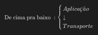
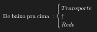

# Let's Encrypt
Com o aumento da transmissão de informação, foi necessário criar uma forma de fiscalizar a transmissão dos dados para garantir a segurança. E nesse contexto surgiu a Let's Encrypt.

# Como garantir a segurança?
A Let's Encrypt é uma **autoridade de certificação**. Ela gera um certificado de **criptografia TLS (Transport Layer Security)** que guarda informações sobre o servidor tornando possível a confirmação que a comunicação entre cliente e servidor é direta.

# O que o Let's Encrypt faz?
Ativa o **HTTPS (Hyper Text Transfer Protocol Secure)** usando um software com o protocolo **ACME (Automated Certificate Management Environment)**.

# Https

A principal diferença entre um protocolo **HTTP** e o **HTTPS** : **no HTTPS a comunicação é criptografada**, no **HTTP, não**.

### Explicando o HTTP

Essa transferência só ocorre porque existem alguns protocolos de rede que auxiliam na transmissão: **TCP (Transmission Control Protocol)** e **IP (Internet Protocol)**

 - **Aplicação**

Tudo começa com a conversa entre um programa e a aplicação. Essa camada é responsável por processar as requisições e passar o dado para a camada de transporte.

 - **Transporte**

Possui duas funções. 

“Pegar” o dado enviado pela camada de Aplicação, dividindo este dado em pacotes a fim de enviar ele para a camada inferior, a da Rede. 

Colocar os pacotes de dados recebidos da camada de rede em ordem, checa se o conteúdo dos pacotes estão intactos e manda para a aplicação.

 - **Rede**

É aqui que temos o IP (Internet Protocol) que pega os pacotes recebidos da camada de Transporte e adiciona uma informação de endereço virtual (IP).

 - **Interface de Rede**

Os dados que aqui chegam são chamados de Datagramas.

A Interface de Rede vai pegar os pacotes enviados pela camada de Rede e enviar os mesmos através da rede (ou receber da rede, se o computador estiver recebendo dados).

# ACME (Automated Certificate Management Environment)

A função desse protocolo é automatizar o gerenciamento de certificados para validação de domínio ou seja, facilitar a configuração de sites HTTPS e tornar a web mais segura. Etapas:
1. Iniciar o cliente;
2. Selecionar o nome de domínio para validar;
3. Escolher a Autoridade de Certificação;
4. Em background o servidor do cliente vai enviar uma requisição para a Autoridade de Certificação;
5. O Cliente do ACME resolve os desafios;
6. O ACME pega o certificado e instala.

É muito simples. O que deve ser feito é a adição do repositório e a instalação do **certbot** (Que é um **Gerenciador de certificados**) e depois a geração do certificado através do gerenciador.

    sudo add-apt-repository ppa:certbot/certbot
    sudo apt-get update
    sudo apt-get install python-certbot-ngnix
    sudo certbot --nginx -d example1.com -d www.example2.com

O gerenciador Certbot é responsável por:
- *solicitar* o certificado;
- *conduzir o processo de validação* do domínio (Ele basicamente solicita que um arquivo seja colocado em um local específico do site);

- *instalar* o certificado;
- *configurar a encriptação* HTTPS no servidor HTTP;
- *renovar* regularmente o certificado.

# Comandos adicionais

- Checar quando um certificado SSL expira	

        echo | openssl s_client -connect ncdc.pt:443 2>/dev/null | openssl x509 -noout -dates

- Extrair todas as informações do certificado

        echo | openssl s_client -connect ncdc.pt:443 2>/dev/null | openssl x509 -noout -text

- Renovando um certificado

        certbot renew <Domínio>

- Revogando um certificado

        certbot revoke