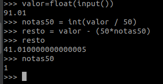
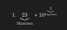
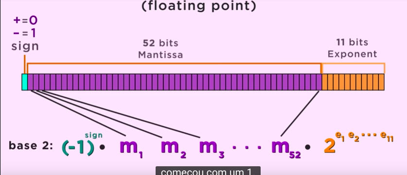
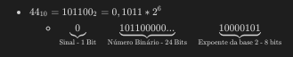
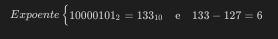
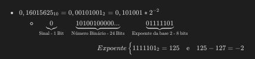
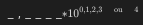
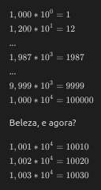
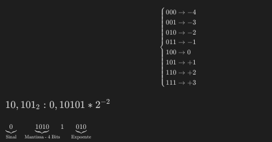
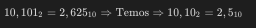

# Ponto Flutuante

Já se perguntaram porquê em programação usamos o termo "Ponto flutuante" para nos referir a números decimais?

Bom, o assunto é complexo e bastante interessante. Tentarei de forma breve expor meus conhecimento.

# Qual a motivação?

Resolvendo um dos exercícios do [URI](https://www.urionlinejudge.com.br/judge/pt/problems/view/1021) me deparei com um problema:

Fui orientado a assistir um vídeo sobre ['A álgebra do computador'](https://www.youtube.com/watch?v=pQs_wx8eoQ8).

## Porque tive esse erro no meu programa?

Se você está lendo esse documento, certamente sabe que o computador usa o sistema de numeração binário. E esse é a justificativa para o erro.

Os computadores usam um espaço de 32 bits para armazenar qualquer número (Independente se a arquitetura é de 64 ou 32 bits). Além disso, o computador usa conceitos de notações científicas para esse armazenamento. Usando essa mesma notação científica:

Desses 32 bits, o primeiro dele apresenta o sinal do número, os 24 subsequentes representam o número em binário (**Mantissa**) e os 8 últimos, representam o expoente da base 2 (O valor e o sinal vêm da [notação de excesso](http://producao.virtual.ufpb.br/books/camyle/introducao-a-computacao-livro/livro/livro.chunked/ch03s07.html) ou de algum outro método usado para definir o centro, os números positivos e os números negativos na linha dos reais). Essa imagem representa 64 bits para armazenamento.

Exemplo:

Porque eu tenho '10000101' no expoente do 2??

    Pois a forma que o computador utiliza para diferenciar os números maiores ou menores que 0 é usando o valor do expoente menos 127 (Que é a metade do maior número que consigo fazer com 8 bits binários). Logo:

#

Outro exemplo

Por ter um espaço limitado para representar os valores, chega um momento que alguns valores são pulados. Para entender melhor, vamos pensar em números com 4 dígitos significativos (Que é **Mantissa** ou parte decimal da notação).

 aqui conseguimos representar quaiquer valores entre 0 e 10000. Todavia, quando completamos as 4 casas e tentamos aumentar o número, notamos saltos. Observe:

É fácil perceber que começarmos a saltar valores. Como representar 10014 ou 10012 ou 10009 ?? É isso que acontece no computador com números grandes. Ele tem uma quantidade limitada de bits então não é possível representar todos os valores possíveis.

# 

### Mas, isso não justifica meu problema. Então vamos adiante..

# Problema com arredondamento

Usarei um exemplo usando 8 bits para explicar.

Imagine, temos 8 bits para representar o número 2,625 na base 10 que equivale a 10,101 na base 2

- 1 Bit - Sinal
- 3 Bits - Expoente
- 4 Bits - Mantissa

Usarei a notação de excesso usando os 3 bits do expoente:

Como só tenho 4 bits para usar e o número é de 5 bits, vemos que 1 bit irá sobrar e o número não é exatamente o que eu queria. Em vez de:

Percebe o erro de aproximação? Foi exatamente isso que aconteceu no meu problema. Para resolvê-lo usei um **módulo do python**, o [Decimal](https://docs.python.org/2/library/decimal.html).