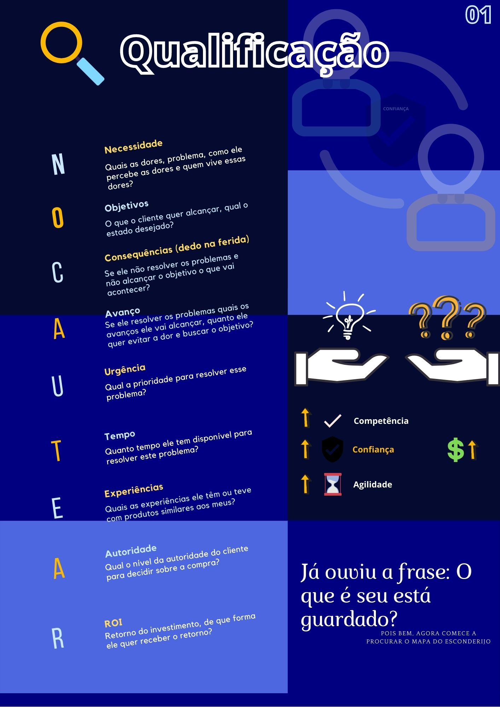

# **Introdução**
### ***"Tudo é óbvio desde que você saiba a resposta"***

Começarei a escrever o que tenho aprendido sobre vendas com o intuito de concretizar e melhorar meu conhecimento. A ideia é apresentar o processo de venda ativa B2B como algo replicável, escalável, simples e funcional  O documento está dividido em duas partes, uma teórica e uma prática e em ambas, discorrerei sobre **o meu ponto de vista e as minhas conclusões**.

Um ponto legal de se reforçar é que apesar das diferenças entre os modelos de venda, ambos envolvem relação de confiança **Cliente** $<->$ **Vendedor**. Diferença entre vendas B2B e B2C:
  - Venda B2B:
    - Racional
    - O vendedor assume um papel de consultor
    - Tempo de negociação mais longo

  - Venda B2C:
    - Emocional
    - O vendedor assume um papel de psicólogo
    - Negociação imediata (Ou quase)

**Obs.:** Não tome tudo que está escrito aqui como verdade pessoal. Saiba filtrar e adaptar o que for necessário e lembre-se que a venda não é uma ciência exata e muito menos existe uma fórmula para tal.

### *Toda conquista começa com a decisão de tentar*

# **Por que é necessário vender ativamente?**

### *Se não houver vento, reme!*

Venda passiva   | Venda ativa
--------- | ------
Barco levado pelo vento | Barco com um remo
Chuva | Água encanada
O cliente pode ou não te escolher | Você escolhe o cliente
Sorte | Metas mensuráveis
Goteira | Balde de água

### ***"Por que um gerente de uma empresa grande que ganha 50.000 R$ contrataria uma empresa que conheceu pelo site ou pela internet e colocaria em jogo seu salário?"***

A partir do momento que você escolhe o cliente, seu esforço de venda se torna específico. E além disso, na maioria das vezes : 

<center>
Direção > Velocidade
</center>

### **"Em um mundo onde tudo é commodities, o diferencial é você!"**

# **Parte teórica**
A venda é dividida em algumas etapas seguindo algumas linhas básicas. Lembre-se de se programar antes de realizar as tarefas.
## **Etapas de venda**
1. **Examinar**: Perceber a sutileza na diferença entre segmentos da persona
2. **Diagnosticar**: Analisar e definir todas as opções para resolução dos problemas
3. **Negociação**: Diagnóstico condizente com a realidade


## **Prospecção**

<center>
Imagine que você é um Engenheiro e seu papel é modelar uma peça de motor do carro. Por onde você começa?
</center>

Mesmo que você não seja um Engenheiro e não faça ideia de por onde começar, uma coisa é fato, você sabe que não começará pelos detalhes. Na etapa de prospecção existem duas etapas:
### **Mapa geral**
  - Te mostra um panorama geral dos seus objetivos.
### **Mapa específico**
  - Te mostra detalhes sobre seus objetivos.

Ok! Mas, como fazer um mapa geral? Por onde começar?


O mapa específico envolve a prática da prospecção. Logo, será visto posteriormente. Agora, você precisa somente do seu mapa geral.


## **Qualificação** 
```
Entenda que as pessoas que irão comprar na empresa apanha, todos os dias para os problemas da empresa e todos querem 'arrancar um pedaço' da empresa deles. Seu papel é resolver problemas!
```
Através de pesquisas na internet, seu conhecimento de mercado e do seu produto responda algumas perguntas para cada empresa da lista:




## **Diagnóstico**

Encontre formas de agregar valor à solução. Conheça bem o mercado para mostrar na proposta que você sabe o que está falando. Se o seu conhecimento ou seu serviço não tem alto valor para as empresas, se integre com outras pessoas, agregue serviços, faça e proponha pacotes maiores. Nem sempre o que tem valor para você, tem valor para o cliente, saiba que o "valioso" é relativo, por exemplo:

```
O cliente não quer pagar 1000 reais em um servidor dedicado (algo mais complexo) mas paga 2000 para configurar um site wordpress(algo extremamente simples) e 1000 para comprar o domínio (algo extremamente simples)!! VENDA!
```
## **Proposta/Apresentação**

Seja profissional na montagem da proposta. O que o cliente precisa saber é que você existe, que você consegue resolver o problema dele com o seu produto (ou serviço) e que ele pode confiar na sua empresa.


## **Contrato/Negociação**
- Evite burocracias demais
- Use seus casos de sucesso
- Tenha vários arcenais de ténicas

# **Prática**

## **Prospecção**
### *"Faça a sua ligação ser agradável e seja a prova de frustração!"*

Agora que você já tem o mapa geral definido, a lista com seus 10 clientes, é hora de começar a definir o mapa específico. Aqui você deverá fazer várias ligaçẽs e mandar vários e-mail's. Faça:
- Um documento de apresentação da sua empresa;
- Um e-mail padrão de apresentação;
- Se prepare, sorria, estado de espírito é importante, se vista bem, tome banho, relaxe, se sinta energizado, sorria, dê umas risadas, **espere respostas ruins como sendo normais**;
- Se programe no dia para o momento de prospecção, tenha um tempo exclusivo pra isso, separe um horário de ligação por semana (2 horas de ligação para prospecção por exemplo). Sobre as primeiras ligações entenda que:
  - Você não quer vender na primeira ligação, quer informações, consiga a hierarquia da empresa. Quem é o tomador de decisão?

Seu principal objetivo é conseguir marcar uma reunião com alguma pessoa influente. Esse é o ÁPICE para você que está no momento de prospecção. Alguma possível objeção que pode surgir enquanto conversa com a pessoa influente:
- Objeção de mercado
  - O cliente teve experiências ruins com o meu mercado;
  - Para resolver, foco na transformação que proporcionamos.


<center>
"Entenda que você vai incomodar e tem que arrumar uma forma de motivar e segurar a atenção da pessoa do outro lado do telefone. 
</center>


Pense bem na taxa das ligações que você fará. No meu caso:
1. Durante a venda: 1 ligação por semana
2. Durante a negociação: 2 ou 3 ligações por semana
3. Durante o fechamento de contrato: todos os dias


## **Proposta**
### *É melhor uma amizade criada em um negócio do que um negócio criado por amizade*

Bom, se você está na parte de proposta, já conseguiu marcar a primeira reunião. Seu papel é criar afinidade com o seu cliente, criar amigos.

- Como? 
  - Ajude a resolver problemas de forma ágil, perfeita e confiável;
  - Demonstre lealdade, honra, segurança. Esses são princípios importantes no primeiro momento;
  - Sempre bom ânimo, nunca reclame do trânsiso ou de lugar para estacionar, seja pontual, **não leve problemas**.

Aqui, o cliente vai te conhecer e perceber as coisas (Ver seu comportamento, olhos nos olhos), você vai surgir no universo do seu cliente como uma pessoa normal. Ele agora precisa saber que você e sua empresa existem você deve se apresentar, apresentar sua empresa e apresentar seu produto. Se o cliente criar **confiança** em você, na sua empresa e no seu produto, você cria uma boa relação. Nessa etapa você vai precisar de uma apresentação profissional (Mostre alguns resultados, eles são incontestáveis) e um cartão de visita (deixar o cliente confortável, pelo o menos agora ele vai saber pronunciar seu nome). Não dê brechas para o surgimento de nenhuma das objeções:

- Objeção de confiança
  - **Não fale do produto**, gere confiança;
  - Gere confiança em Você, na sua empresa e no seu produto. 
- Objeção de produto/solução
  - **Não foque apenas nas características** do produto;
  - Foque nas vantagens e benefícios.

- Objeção de capacidade de fornecimento
  - Não force a venda;
  - Passe segurança com depoimentos e cases de sucesso.


### *Evite quaisquer obstáculos que podem gerar críticas.*


Sua reunião deve ser um presente, imagine seu cliente chegando em casa e contando de você para a família dele. Seja um negociador. Inove reuniões,  fale algo interessante, seja uma ponte de informação!

Negociador   | Vendedor
--------- | ------
Entende os dois lados | Só quer ganhar sua porcentagem
Negocia e Fecha contrato | Só vende

```
Para vender, você precisa de confiança mas para conseguir confiança, você precisa vender. Ou seja, venda serviços 'de Graça' se for preciso para grandes empresas e faça um serviço fantástico;
```

Existem duas formas de se conquistar confiança:
1. Indicação de alguém confiável;
2. Agindo positivamente e fazendo serviços fantásticos com lealdade. Lembre-se, uma grande empresa só contrata uma empresa pequena pela agilidade.

Serviços pequenos em grandes clientes, servem como sementes. Um serviço bem feito alavanca o próximo serviço. Se esforce para ser:
  - Estável (Demonstre estabilidade);
  - Confiável;
  - Atencioso (100% de atenção).

### *"A confiança é construída e não obtida por diplomas."*

## Acompanhamento (Follow Up)
Após a primeira reunião, o processo de acompanhamento é iniciado. Nessa etapa, o conceito mais importante é o **bom senso**.
<center>
"Tenha bom senso, tente vender MAS NÃO SEJA CHATO"
</center>

O acompanhamento envolve troca de conhecimento. Tudo é oportunidade para manter relacionamento. Tenha um bom intervalo entre os acompanhamentos (diminuindo frequência):
  - Durante o 1º mês, ligue de 1 em 1 semana;
  - Durante o 2º mês, ligue de 2 em 2 semanas;
  - Durante o 3º mês, ligue de 1 em 1 mês;

Uma vez que sua memória não é infinita, documentar as ligações e as etapas do acompanhamento é importante. Acompanhamentos devem ser feitos todos no mesmo dia. Durante o acompanhamento, tudo que o cliente te fala é um presente, ele conhece o mercado na prática e pode apresentar:
  - Possíveis mudanças de direção no seu setor;
  - Possíveis mudanças de serviço.

Saiba as perguntas certas:
  - "O que eu posso fazer para te ajudar?"

Network é mais que facebook, demanda alimentação. Cuide da sua ferramenta de trabalho!!!


# Considerações finais

## O cérebro humano e as vendas

O cérebro humano só se preocupa com reprodução e preservar energia (sobrevivência) e com o passar do tempo desenvolveu algumas propriedades para não "ficar doido" mediante à quantidade excessiva de informações:
  - **Excluir:** Tem informação que eu não preciso me preocupar (por exemplo, agora, seu pé direito. Agora você sentiu ele).
    - Exemplo: imagine um quiosque no shopping, você passa lá tantas vezes que nem percebe mais que ele existe. Solição: Mude as coisas de lugar, crie um desconto para um público específico cada dia.
  - **Generalizar:** Quando o cérebro vai encontrar padrões e repetir padrões (Que é o que o cérebro faz), começam a surgir expressões como: "Isso sempre acontece", "Isso nunca aconteceu" por que é mais fácil tratar a informação em bloco;
  - **Distorcer:** Pegar um ambiente e distorce/moldar ele de acordo com as minhas percepções.
  - 
Algumas técnicas para prospecção, proposta e acompanhamento podem ser encontradas no arquivo ['Mão_Na_Massa.md'](Mão_Na_Massa.md) 

# Bibliografias indicadas
1. O gene egoísta;
2. A estratégia do Elefante;